# focus-fusion

**FocusFusion** — Cross-Attention Fusion of LiDAR and Vision Features for 3D Semantic Segmentation.

CS231N (Stanford) final project by Edward Lee, Saif Moolji, and Umar Padela.

## Overview

3D semantic segmentation — labeling every point in a LiDAR scan as road, vehicle, pedestrian, cyclist, traffic cone, etc. — is a core perception task for autonomous driving. LiDAR gives precise geometry but no color or texture, so objects that look similar in shape (a thin pole vs. a distant pedestrian) are easy to confuse. Camera images carry exactly the appearance cues LiDAR lacks, but fusing the two modalities traditionally means projecting LiDAR points onto the image plane with a calibration matrix — a strategy that breaks down wherever calibration is imperfect or a point falls outside the camera's field of view.

**Research question:** Can a lightweight cross-attention module learn useful point-to-image correspondences directly from frozen LiDAR and vision features, without any calibration?

**Our approach:** FocusFusion replaces projection with **learned global cross-attention**. Every LiDAR point is free to attend to every image patch across all six surround-view cameras, so the network discovers which visual regions matter for each point on its own. We also add a simple, parameter-free **memory bank** that lets points draw on recent camera history in case the current frame occludes something relevant. Only the fusion layer and segmentation head are trained — the LiDAR and vision backbones stay frozen.

## Architecture

<p align="middle">
  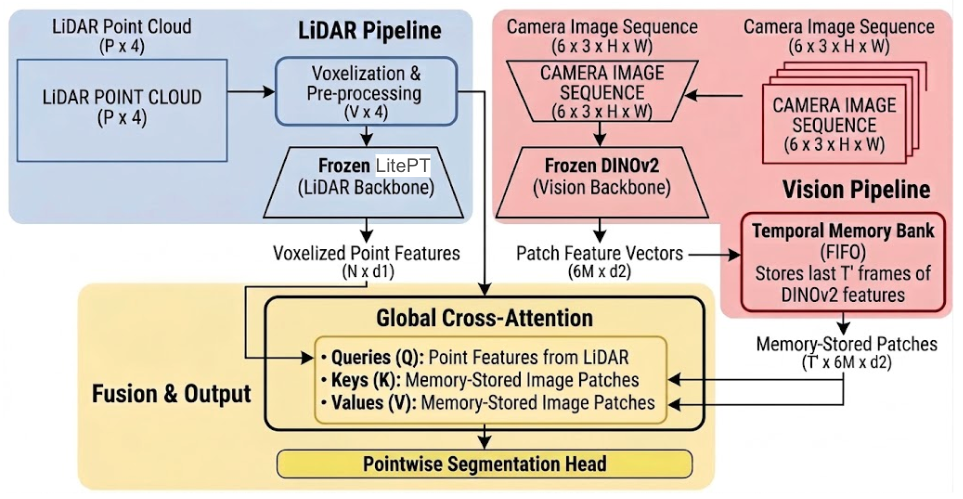
</p>

Two frozen backbones extract features from each modality:

- **LitePT** — a lightweight point-transformer LiDAR encoder — extracts a `72`-dim geometric feature per point.
- **DINOv2** (ViT-S/14) — a self-supervised vision transformer — extracts `384`-dim patch embeddings from each of the six camera images.

DINOv2 patch embeddings from the most recent `T` keyframes are concatenated into a FIFO **memory bank**. LiDAR point features then serve as *queries* and the memory bank's patch embeddings serve as *keys/values* in a standard multi-head cross-attention layer (8 heads) — every point attends to every patch token, with no geometric mask or calibration. The fused per-point features are passed through a lightweight 2-layer MLP head to predict one of 16 nuScenes semantic classes. Training combines cross-entropy with a Lovász-Softmax term (weight `λ`) that directly optimizes per-class IoU to counter class imbalance.

## Dataset

We evaluate on [nuScenes lidarseg](https://www.nuscenes.org/nuscenes): 32-beam LiDAR sweeps paired with six synchronized surround-view cameras, annotated at 2 Hz and remapped to 16 semantic classes. To study the effect of training data scale, we train on a 10-scene subset (~400 keyframes) and the full 70-scene `blob1` split (~2800 keyframes) of the nuScenes training data, tune on `blob1`'s own validation split, and report final numbers on the held-out nuScenes mini validation split.

## Results

### Baseline: LitePT vs. FocusFusion

| Method | mIoU | mAcc | fwIoU |
|---|---|---|---|
| LitePT (LiDAR only) | 0.606 | 0.808 | **0.911** |
| **FocusFusion** | **0.810** | **0.876** | 0.903 |

Fusing in vision features gives a **+20.4% mIoU** jump over the LiDAR-only baseline, driven mostly by better performance on geometry-ambiguous classes.

### Qualitative predictions

Ground truth vs. FocusFusion prediction, with LiDAR points projected onto the front camera and colored by class. Road, vegetation, and vehicles are segmented well; the main failure modes are sidewalk/terrain confusion and missed traffic cones.

<p align="middle">
  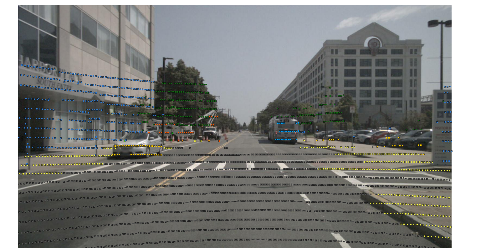
  
</p>
<p align="middle">
  
</p>

### Cross-attention visualizations

To see what the model is actually attending to, we take a query point's attention weights, average over heads, and overlay the result as a heatmap on the source camera image (warmer = higher attention).

<p align="middle">
  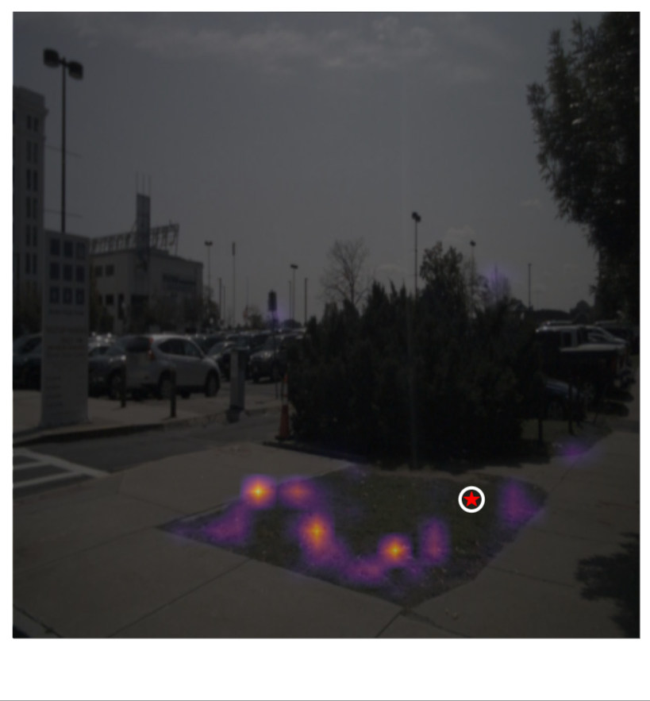
  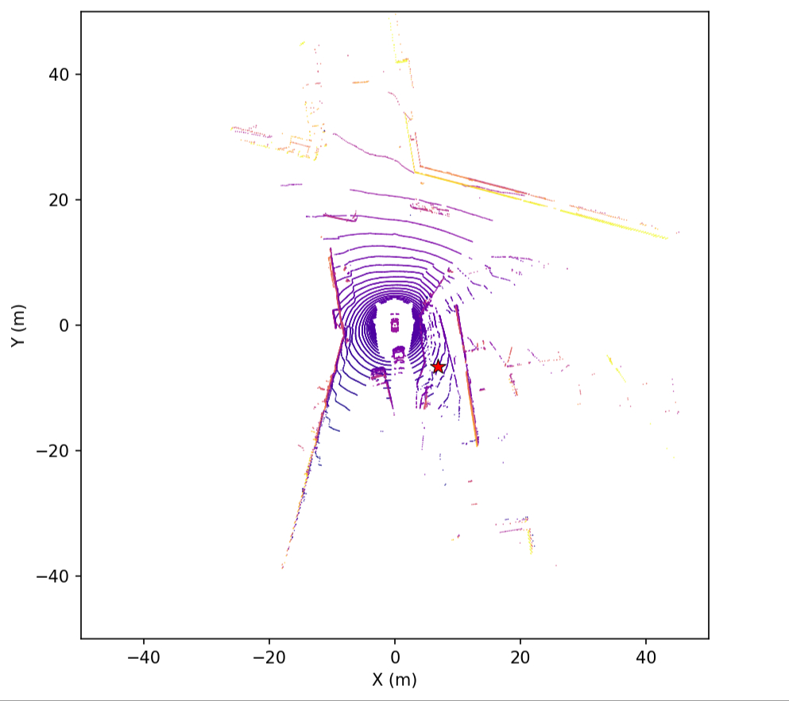
</p>
<p align="middle">
  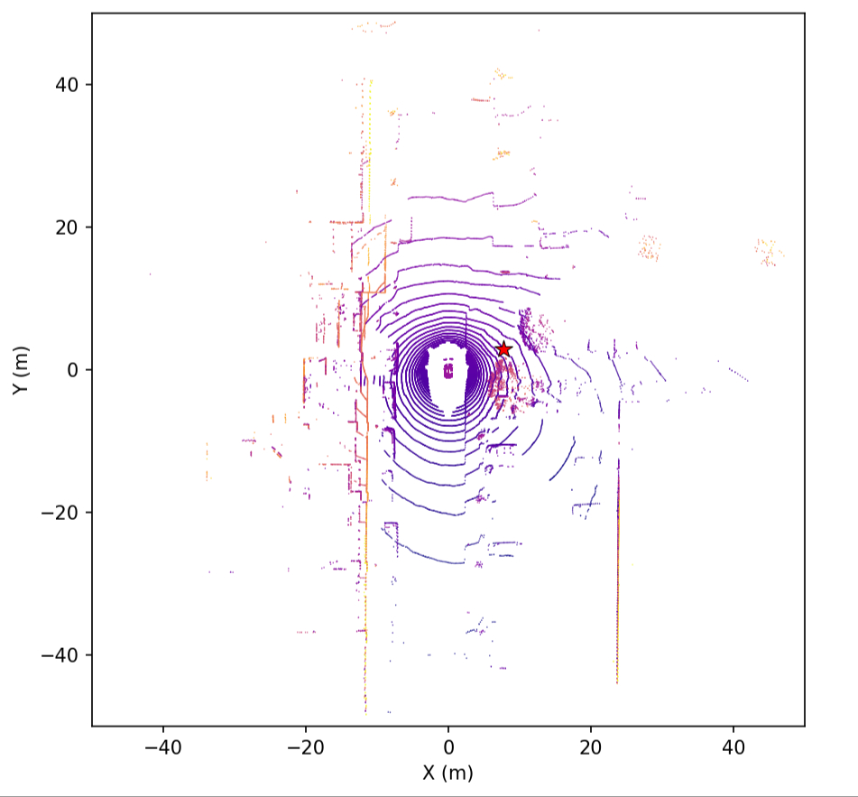
  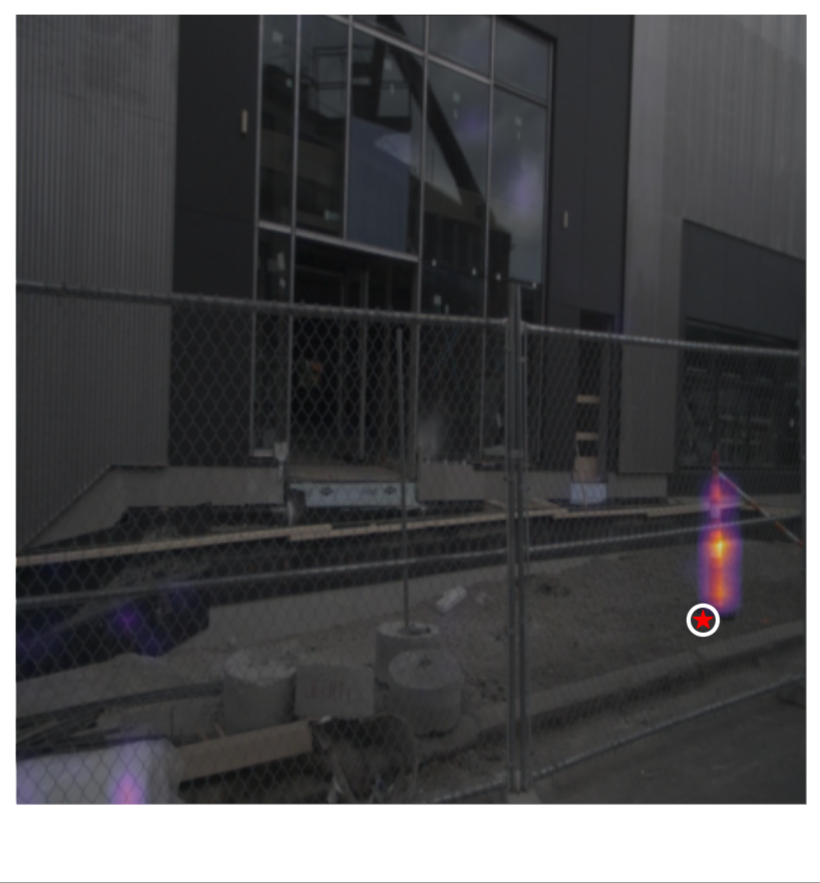
</p>

A **terrain** query point (left) spreads attention diffusely across the surrounding grass, consistent with grass's homogeneous appearance. A **traffic cone** query point (right) produces a sharp attention spike on the cone's orange patches. Both correspondences are learned **without any calibration**.

## Ablations

### DINOv2 layer selection

Deeper DINOv2 layers resolve increasingly fine object boundaries. We visualize this with PCA over patch embeddings (top-3 components mapped to RGB):

<p align="middle">
  
  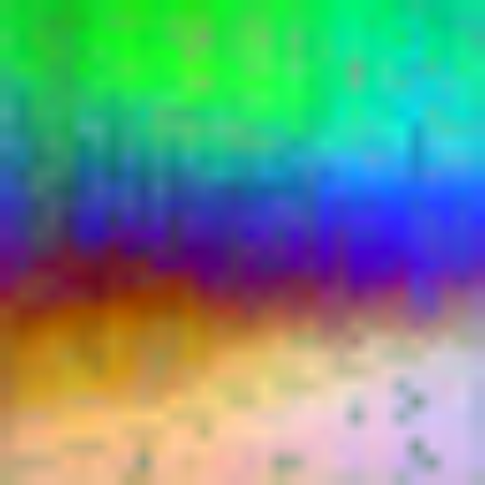
  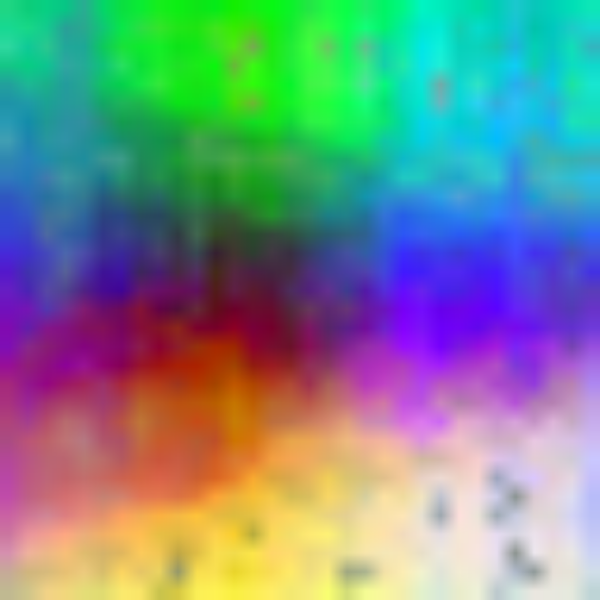
  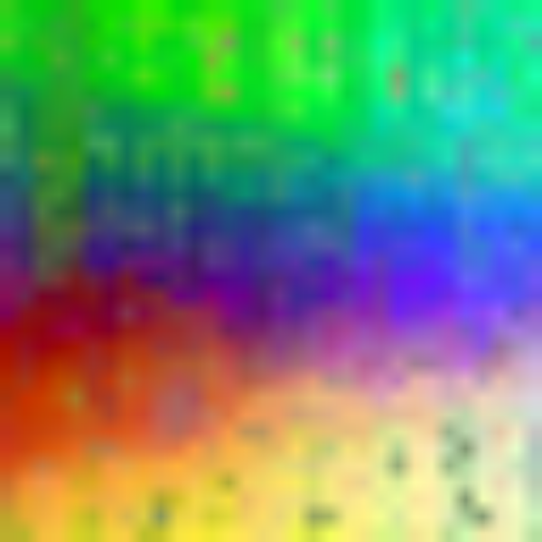
  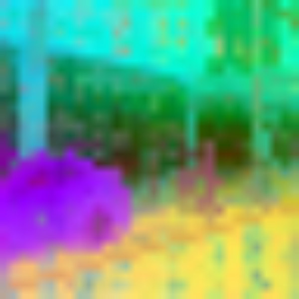
</p>

| Features | mIoU | mAcc | fwIoU |
|---|---|---|---|
| Layer 12 only (`D_v=384`) | 0.683 | **0.798** | **0.909** |
| Layers 9+12 concat (`D_v=768`) | **0.685** | 0.782 | 0.907 |

Concatenating layer 9 doubles the feature dimension for a negligible mIoU gain, so layer 12 alone is the default.

### Lovász loss weight (λ)

| λ | mIoU | mAcc | fwIoU |
|---|---|---|---|
| 0 | 0.639 | **0.809** | 0.903 |
| **0.25** | **0.683** | 0.798 | 0.909 |
| 0.5 | 0.681 | 0.783 | **0.910** |

Pure cross-entropy (`λ=0`) is dominated by common classes; `λ=0.25` gives rare classes a stronger signal without over-penalizing, and is used for all other experiments.

### Temporal memory bank depth (T)

| T | mIoU | mAcc | fwIoU |
|---|---|---|---|
| **1** | **0.810** | **0.876** | **0.903** |
| 6 (3 s history) | 0.806 | 0.875 | 0.902 |

At this training scale, single-frame vision context (`T=1`) slightly edges out the 6-frame memory bank — attending over a 6x longer key/value sequence needs more training diversity than 70 scenes provides to be learned reliably.

### Training data scale: 10 vs. 70 scenes

<p align="middle">
  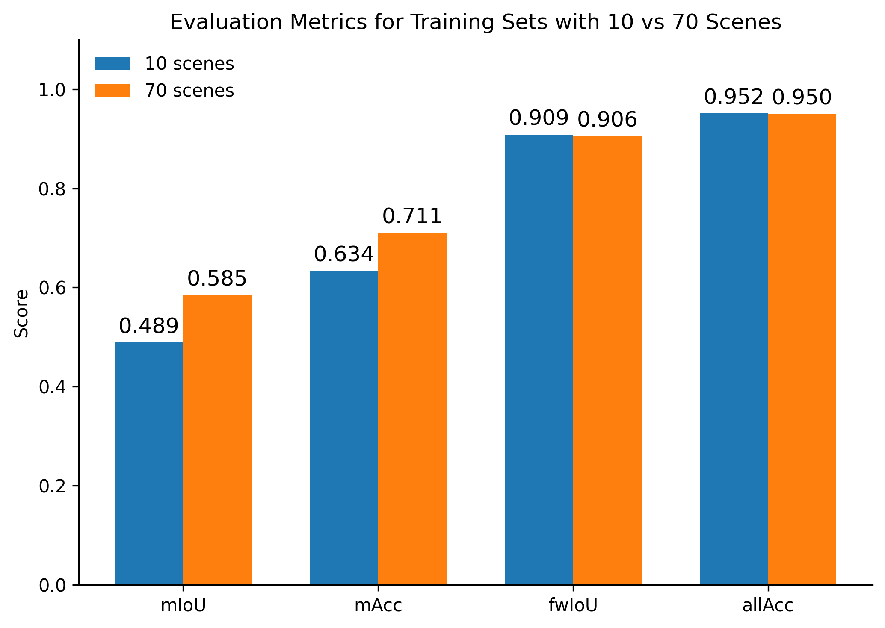
</p>
<p align="middle">
  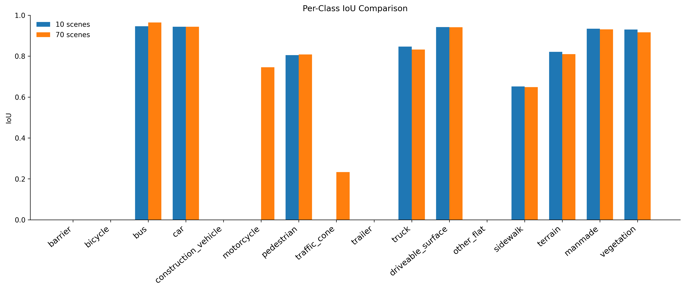
</p>

Scaling from 10 to 70 scenes improves mIoU by ~19.6% and mAcc by ~12.1%. The per-class breakdown shows why: rare classes like motorcycle and traffic cone go from unlearnable at 10 scenes to reasonably accurate at 70 — the fusion module's projection weights have no pre-aligned cross-modal signal to start from, so they need diverse examples to discover useful correspondences.

## Key takeaways

- Learned global cross-attention fuses frozen LiDAR and vision features effectively, with **no calibration needed at inference**.
- Attention maps confirm the model discovers semantically meaningful point-to-image correspondences purely from data.
- More training scenes help substantially, especially for rare/safety-critical classes — the biggest lever at this scale.
- The temporal memory bank doesn't help yet at 70 scenes; we expect it to pay off with more training data and better temporal encodings (see Future Work).

**Limitations:** temporal fusion needs more data than we had to train reliably; small/rare/occluded objects (traffic cones especially) remain hard.

**Future work:** train on the full 700-scene nuScenes split or Waymo Open Dataset; add temporal positional embeddings and camera identity tokens to the memory bank; explore calibration-guided attention masks and FlashAttention for longer temporal windows; fine-tune the frozen backbones on driving data.

The full write-up (related work, architecture details, hyperparameters, and complete discussion) is in [`paper_final/main.tex`](paper_final/main.tex); the presentation poster is in [`poster/`](poster).

## Repo layout

| Path | What |
|---|---|
| `focus_fusion/` | Core package: datasets, models, training loop, losses, eval/visualization |
| `train/` | Training entrypoint |
| `configs/` | Experiment YAML configs (`default`, `nuscenes`, `mini`, layer/loss variants) |
| `modal/` | Modal (cloud GPU) entrypoints for setup, training, eval — see [`modal/README.md`](modal/README.md) |
| `third_party/` | `dinov2` git submodule (vision backbone) |
| `ptv3_nuscenes_baseline/` | Standalone LiDAR-only (LitePT/PTv3) baseline via Pointcept |
| `scripts/` | Data download checklist, preprocessing |
| `tests/` | Unit tests (cross-attention, memory bank, dataset, losses, metrics) |
| `paper_final/` | Final paper source + result figures |
| `poster/` | Poster source + result figures |
| `data/` | nuScenes data root (gitignored) |
| `checkpoints/` | Pretrained backbone weights (gitignored) |

## Setup

### 1. Clone (with submodules)

`third_party/dinov2` is a git submodule — clone with `--recurse-submodules` so it's checked out at the pinned commit:

```bash
git clone --recurse-submodules <repo-url>
cd focus-fusion
```

Already cloned without it?

```bash
git submodule update --init --recursive
```

### 2. Local environment

Local dev runs CPU-only (dataset code, tests); GPU training runs on Modal.

```bash
conda env create -f environment.yml
conda activate focus-fusion
```

### 3. LitePT / Pointcept

LitePT runs through [Pointcept](https://github.com/Pointcept/Pointcept). It's too large to vendor as a submodule — clone it separately:

```bash
git clone https://github.com/Pointcept/Pointcept.git third_party/pointcept
```

See [`third_party/README.md`](third_party/README.md) for pinned commits and pretrained weight sources.

### 4. Data

nuScenes requires an authenticated download, so `scripts/download_nuscenes.sh` is a checklist:

1. Download `v1.0-mini.tgz` and `nuScenes-lidarseg-mini-v1.0.tar.bz2` from the [nuScenes download page](https://www.nuscenes.org/nuscenes#download).
2. Place both archives in `data/archives/`.
3. Extract:
   ```bash
   mkdir -p data/nuscenes
   tar -xzf data/archives/v1.0-mini.tgz -C data/nuscenes
   tar -xjf data/archives/nuScenes-lidarseg-mini-v1.0.tar.bz2 -C data/nuscenes
   ```
4. Verify:
   ```bash
   python scripts/preprocess.py --dataroot data/nuscenes --split mini_val --summary-only
   ```

### 5. Run tests

```bash
pytest                    # full suite
pytest -m "not slow"      # skip tests that download model weights / run full inference
```

### 6. Train & evaluate

GPU training runs on [Modal](https://modal.com/), not locally. Full setup (auth, W&B secret, uploading data to a Modal volume, downloading the LitePT checkpoint) and all training/eval commands are in [`modal/README.md`](modal/README.md). Once set up:

```bash
modal run --detach modal/modal_train.py --experiment e1   # T=1, single-frame
modal run --detach modal/modal_train.py --experiment e2   # T=6, temporal
modal run modal/modal_eval.py --experiment e1
```

Experiments are configured via YAML in `configs/` (see `configs/default.yaml` for all fields).

## Team & contributions

- **Edward Lee** — LitePT backbone, baseline metrics, fusion training script debugging.
- **Saif Moolji** — Fusion model and training scripts, temporal ablation, training-data-scale ablation.
- **Umar Padela** — DINOv2 backbone, Lovász and DINOv2-layer ablations, attention heatmaps, ground-truth/prediction visualizations, DINOv2 PCA analysis.

## References

1. Caesar et al. (2020). *nuScenes: A multimodal dataset for autonomous driving.*
2. Knobel et al. (2025). *LitePT: Lighter Yet Stronger Point Transformer.*
3. Oquab et al. (2024). *DINOv2: Learning Robust Visual Features without Supervision.*
4. Vora et al. (2020). *PointPainting: Sequential Fusion for 3D Object Detection.*

Full bibliography in [`paper_final/egbib.bib`](paper_final/egbib.bib).

## License

MIT — see [`LICENSE`](LICENSE).
