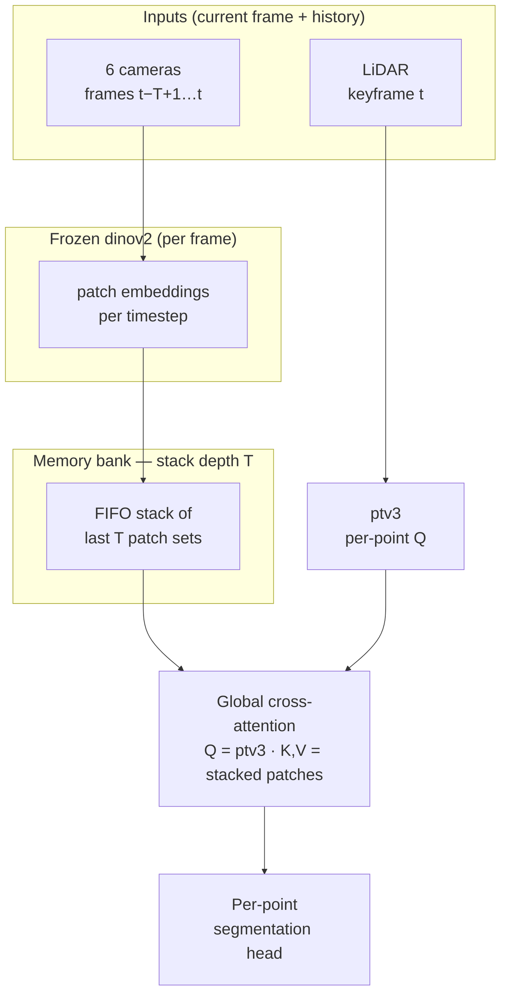

# FocusFusion — Project Plan

**FocusFusion: Cross-Attention for LiDAR-Vision Segmentation**

Living document for CS 231N. See [project_proposal.md](project_proposal.md) for the formal proposal and citations.

---

## Table of contents

| Part | Sections | Use when you need… |
|------|----------|-------------------|
| **I — Overview** | [§1 Goal](#1-goal) · [§2 Architecture](#2-architecture) | What FocusFusion is; how the stack fits |
| **II — Repository & code** | [§3 Layout](#3-repository-layout) · [§4 Code map](#4-code-map) · [§5 Data](#5-data) | Where files go; dataset paths and artifacts |
| **III — Experiments & execution** | [§6 Evaluation](#6-evaluation) · [§7 Work partition & plan](#7-work-partition--execution-plan) | Metrics, baselines, **who does what** |
| **IV — Project admin** | [§8 Open decisions](#8-open-design-decisions) · [§9 Team](#9-team) · [§10 Git](#10-git) · [Changelog](#changelog) | TBDs, ownership, git |

---

# Part I — Overview

## 1. Goal

Build **FocusFusion**, a multi-modal framework for **3D semantic segmentation** that fuses LiDAR geometry with 2D vision semantics via **learned global cross-attention** over a **memory bank** of recent **dinov2 patch embeddings** (depth `T` is a hyperparameter), and evaluate it against a LiDAR-only baseline on **nuScenes mini** lidarseg.

**Success criteria**

| Criterion | Target |
|-----------|--------|
| Segmentation quality | Beat frozen **ptv3-only** baseline on mIoU / mAcc / fwIoU |
| Fusion validity | Attention maps align with relevant image regions for queried points |
| Temporal benefit | `T > 1` patch stack improves over `T = 1` on dynamic / ambiguous classes (same architecture) |
| Practicality | Training and inference feasible on course GPU budget; robustness spot-checks under degraded inputs |

**Non-goals (initial scope)**

- End-to-end finetuning of large backbones (**ptv3**, **dinov2** stay frozen at first)
- Open-vocabulary or panoptic segmentation (semantic per-point labels only for v1)
- Real-time deployment on vehicle hardware
- Projection-concat or other hand-crafted early-fusion baselines (compare against ptv3-only and cross-attention only)
- Calib-based LiDAR→image patch masks in fusion (attention is learned globally over patches)

---

## 2. Architecture

High-level data flow:



**Core design (from proposal)**

1. **ptv3** — Frozen [Point Transformer V3](https://arxiv.org/abs/2406.06189) on the **current** keyframe LiDAR; outputs per-point features used as **Q**.
2. **dinov2** — Frozen [DINOv2](https://arxiv.org/abs/2304.07193) run on each camera image **per timestep** in the window; outputs patch embeddings.
3. **Memory bank (before fusion)** — A **stack** (FIFO, depth `T`) holding the last **T** timesteps of **dinov2 patch embeddings** (all cameras). `T = 1` ⇒ only the current frame’s patches; **`T = 6`** ⇒ **3 s** of history at nuScenes keyframe rate (**2 Hz**). Optional: **frame / camera / patch position embeddings** on stacked tokens. The bank is primarily **storage + concat** (not a second attention block after fusion).
4. **Fusion** — **Global cross-attention**: **Q** from ptv3 (current LiDAR points); **K, V** from **all patches in the stack** (size $\approx T \times P$, $P$ = patches per frame). No hand-built LiDAR→pixel mask — correspondence is learned. Same fusion module for E1 and E2; only stack depth and dataloader window change.
5. **Output** — Lightweight **per-point head** on fused features → class logits.

**Why this order (bank → fusion)?**  
Temporal context lives in **vision patch space**: a point at time $t$ can attend to patches from $t{-}1, t{-}2,\ldots$ (motion, occlusion, blur) before features are merged with LiDAR. LiDAR stays at the **current** frame; history enters through **K/V**, not by re-running fusion each frame.

**Experiments** — We use **E0 / E1 / E2** only (see [§6](#6-evaluation)); there is no separate “B0/B1” label in the repo.

---

# Part II — Repository & code

## 3. Repository layout

Planned structure (greenfield; not all paths exist yet):

```
focus-fusion/
├── project_proposal.md
├── project_plan.md          # this file
├── README.md
├── configs/
│   ├── default.yaml         # paths, model dims, memory_bank.T, train hyperparams
│   └── nuscenes.yaml        # v1.0-mini paths, mini train/val, lidarseg class map
├── data/
│   └── README.md            # download instructions; no raw data in git
├── scripts/
│   ├── download_nuscenes.sh
│   ├── preprocess.py
│   └── visualize_attention.py
├── third_party/                       # git submodules (upstream code; pin commits)
│   ├── README.md                      # init/update instructions, pinned SHAs
│   ├── ptv3/                          # submodule → Point Transformer V3 repo
│   └── dinov2/                        # submodule → facebookresearch/dinov2
├── focus_fusion/
│   ├── __init__.py
│   ├── contracts/                     # week 1: fake_batch, DummyE0 / DummyFocusFusion
│   │   ├── batch.py
│   │   ├── dataset.py
│   │   └── models.py
│   ├── datasets/
│   │   ├── base.py
│   │   └── nuscenes.py
│   ├── models/
│   │   ├── backbones/
│   │   │   ├── ptv3.py                # thin wrapper → third_party/ptv3
│   │   │   └── dinov2.py              # thin wrapper → third_party/dinov2
│   │   ├── fusion/
│   │   │   └── cross_attention.py
│   │   ├── temporal/
│   │   │   └── memory_bank.py         # FIFO stack of T dinov2 patch tensors; T=1 → current frame only
│   │   ├── segmentation_head.py
│   │   └── focus_fusion.py            # full module
│   ├── train/
│   │   ├── trainer.py
│   │   └── losses.py
│   └── eval/
│       ├── metrics.py                 # mIoU, mAcc, fwIoU
│       └── visualize.py
├── experiments/
│   └── logs/                          # gitignored; wandb optional
├── tests/
│   ├── test_cross_attention.py
│   ├── test_memory_bank.py
│   └── test_integration.py            # DummyFocusFusion + FakeDataset + one train step
├── .gitmodules                        # submodule URLs + pinned commits
└── requirements.txt
```

### Third-party submodules

Upstream **ptv3** and **dinov2** live under `third_party/` as **[git submodules](https://git-scm.com/book/en/v2/Git-Tools-Submodules)** so we pin exact commits and avoid copying their code into `focus_fusion/`.

| Path | Upstream (initial target) | Our code |
|------|---------------------------|----------|
| `third_party/ptv3/` | [PointTransformerV3](https://github.com/Pointcept/PointTransformerV3) (confirm before add) | `focus_fusion/models/backbones/ptv3.py` loads weights, calls into submodule |
| `third_party/dinov2/` | [facebookresearch/dinov2](https://github.com/facebookresearch/dinov2) | `focus_fusion/models/backbones/dinov2.py` same pattern |

**Clone / update (after submodules are registered):**

```bash
git submodule update --init --recursive
# or on fresh clone:
git clone --recurse-submodules <focus-fusion-repo-url>
```

**Rules:** Do not commit edits inside `third_party/*` on `main` (fork upstream or patch in wrappers). Record chosen commit SHAs in `third_party/README.md` when pinning. Pretrained weights still go under `checkpoints/` (not submodules).

---

## 4. Code map

| Module | Responsibility | Key inputs / outputs |
|--------|----------------|----------------------|
| `datasets/nuscenes.py` | Load nuScenes frame(s): points, lidarseg labels, multi-cam images | → batch dict |
| `third_party/ptv3`, `third_party/dinov2` | Upstream model implementations (submodules) | pinned in `.gitmodules` |
| `backbones/ptv3.py` | Wrapper: import submodule, load `checkpoints/ptv3/`, frozen forward | `(B, N, 3)` → `(B, N, D_l)` |
| `backbones/dinov2.py` | Wrapper: import submodule, load `checkpoints/dinov2/`, frozen forward | per frame: `(B, P, D_v)` or `(B, 6, P, D_v)` |
| `temporal/memory_bank.py` | FIFO stack of last `T` patch embedding tensors | `(B, T, P, D_v)` → `(B, T·P, D_v)` for fusion |
| `fusion/cross_attention.py` | Q from ptv3; K/V from **stacked** patches (learned; no geom. mask) | fused `(B, N, D_f)` |
| `segmentation_head.py` | MLP / linear per point | logits `(B, N, C)` |
| `models/focus_fusion.py` | ptv3 + dinov2 → patch stack → cross-attn → head | end-to-end forward |
| `train/trainer.py` | Loop, checkpointing, logging | |
| `eval/metrics.py` | mIoU, mAcc, fwIoU on val | |
| `eval/visualize.py` | Attention overlays, error maps | |

**Dependency direction** (no upward imports): `third_party/*` ← `backbones/*` ← `temporal/memory_bank` ← `fusion` ← `models` ← `train` / `eval`; `datasets` feeds all paths.

**Practical note:** Fusion cost scales as $O(N \times T \times P)$. For $T>1$, subsample points, chunk over patch dimension, or cap $T$. Mitigations: 8k–16k points, FlashAttention-style kernels, mixed precision—not calib-based masks unless added as an ablation.

---

## 5. Data

### Dataset — nuScenes mini + lidarseg

All experiments use **[nuScenes v1.0-mini](https://www.nuscenes.org/nuscenes)** with the **lidarseg** extension (32 semantic classes, 6 cameras per keyframe). We use **mini only** (not full trainval) for download size and course compute.

| Item | Detail |
|------|--------|
| Version | **`v1.0-mini`** (+ `lidarseg` for mini) |
| Splits | Official **mini_train** / **mini_val** in the devkit |
| Labels | Per-point lidarseg on keyframe LiDAR |
| Sensors | 32-beam LiDAR + 6 cams per keyframe (all fed to dinov2; fusion does not require calib) |
| Scale | **10 scenes**, **~400 keyframes** total (order-of-magnitude; use devkit counts) |
| Keyframe rate | **2 Hz** → `memory_bank.T = 6` ≈ **3 s** of past patch embeddings |
| Training | Full mini train split; more epochs than a full-dataset run (dataset is small) |

### On-disk layout

```
data/nuscenes/
├── samples/
├── sweeps/
├── v1.0-mini/
└── lidarseg/
    └── v1.0-mini/
```

Processed cache (gitignored), e.g.:

```
data/processed/nuscenes/
├── train/
│   └── {scene_token}_{frame_idx}.pt   # tensors: xyz, label, images
└── val/
```

### Artifacts

| Artifact | Path pattern | Produced by |
|----------|--------------|-------------|
| Raw dataset | `data/nuscenes/` (`v1.0-mini` + lidarseg mini) | `scripts/download_nuscenes.sh` (mini tarball) |
| Processed shards | `data/processed/nuscenes/` | `scripts/preprocess.py` |
| ptv3 weights | `checkpoints/ptv3/` | External download |
| dinov2 weights | `checkpoints/dinov2/` | Hugging Face / torch hub |
| Training checkpoints | `experiments/logs/{run_id}/` | `trainer.py` |
| Eval tables / figures | `experiments/logs/{run_id}/eval/` | `eval/*` |

---

# Part III — Experiments & execution

## 6. Evaluation

### Terminology (E0 / E1 / E2)

One name per **experiment** — same ID in docs, configs, logs, and CLI (`--experiment e0|e1|e2`).

| Exp | What it is | `memory_bank.T` | Train on mini? | Owner |
|-----|------------|-----------------|----------------|-------|
| **E0** | **ptv3-only** baseline — frozen pretrained ptv3, lidarseg **eval** on `mini_val` | — | **No** | Person 1 |
| **E1** | **FocusFusion** — patch stack → cross-attention → head | **1** | **Yes** (hparams tuned here) | Person 3 |
| **E2** | **FocusFusion** — **same code & weights** as E1, deeper patch history | **6** (3 s @ 2 Hz) | **Yes** (frozen hparams from E1) | Person 2 |

**E1 vs E2** is not two architectures — only stack depth `T` and the sequence dataloader change.

### Quantitative metrics

| Metric | Definition | Why we report it |
|--------|------------|------------------|
| **mIoU** | Mean IoU over classes | Standard segmentation quality |
| **mAcc** | Mean per-class accuracy | Per-class balance |
| **fwIoU** | Frequency-weighted IoU | Emphasizes common road / vehicle classes |

Report **per-class IoU** for rare safety-critical classes (pedestrian, cyclist, etc.) in appendix or supplementary table.

### Qualitative analysis

- **Attention maps** — For sampled points, overlay attention weights on the source camera image.
- **Cross-modal errors** — Cases where **E0** fails and **E1** / **E2** succeed.
- **Robustness** — Subsampled points, motion blur / night frames (if tagged), or synthetic dropout of image or LiDAR channels.

### Experiment matrix

Same as the [terminology](#terminology-e0--e1--e2) table. Logs: `experiments/logs/e0/`, `e1/`, `e2/`. Person 3 merges the final comparison table on **mini_val**.

**Optional follow-on experiments** (only if E0–E2 are done and time permits):

| Ablation | What to change | Expected signal |
|----------|---------------|-----------------|
| Single cam vs all-cam attention | Pass only front camera patches as K/V | Quantifies how much rear/side cameras contribute |
| DINOv2 layer 9 vs layer 12 | `get_intermediate_layers(x, n=[8])` vs `n=1` in `backbones/dinov2.py` | Layer 9 captures broader region structure; layer 12 captures finer object detail — paper found layer 9 marginally better |
| Concat layers 9 + 12 | `n=[8, 11]`, `torch.cat(outputs, dim=-1)` → D_v doubles to 768 | Richer features at the cost of 2× K/V memory; update `d_v` in config |
| Temporal PE on E2 | `use_temporal_pe: true` in config | Explicit frame-ordering signal for T=6; off by default since E1 (T=1) gets no benefit from it |
| Camera PE | `use_camera_pe: true` in config | Learned front/rear/side camera identity token added to each patch; cheap (6 × 384 = 2k params) |

### Hyperparameters (training)

| What | Policy |
|------|--------|
| **Tuned on** | **E1 only** — Person 3 (lr, weight decay, epochs, point subsample, …) |
| **Frozen for E2** | Same `configs/default.yaml` as E1 — Person 2, no new search |
| **E0** | No training / no hparams |

**Schedule (2 weeks):** short E1 tune early **week 2** → **freeze YAML by Tue W2** → final **E1** + **E2** in parallel Wed–Fri W2. **E0** eval anytime after loader is real (target **Fri W1**).

---

## 7. Work partition & execution plan

**2 weeks** on **nuScenes mini**. **Week 1:** build + integrate. **Week 2:** run **E0 / E1 / E2** + report.  
**Days 1–2 (all):** Person 3 lands `focus_fusion/contracts/` (`fake_batch`, DummyE0, DummyFocusFusion) so nobody blocks on data or fusion.

Map names in [§9 Team](#9-team). Experiments defined in [§6](#6-evaluation).

### Who owns what

| | **Person 1** | **Person 2** | **Person 3** |
|---|--------------|--------------|--------------|
| **Owns** | Data + LiDAR backbone | Vision + fusion model | Training + evaluation stack |
| **Modules** | `datasets/nuscenes.py`, `backbones/ptv3.py` | `backbones/dinov2.py`, `fusion/*`, `models/focus_fusion.py`, `third_party/*` | `contracts/*`, `train/*`, `eval/*`, experiment CLI |
| **Experiment** | **E0** — frozen ptv3 eval (no training) | **E2** — FocusFusion, `T=6`, frozen hparams from E1 | **E1** — FocusFusion, `T=1`, tune hparams → freeze `configs/default.yaml` → merge final table |
| **Ships to team** | `DataLoader` + E0 metrics on `mini_val` | `model(batch) → {logits, attn_weights?}` on real batches | Trainer + **shared eval scripts**; frozen train recipe for E2 |

**Team gates:** contracts merged (Tue W1) → train step on real batch (Thu W1) → **E0** JSON on `mini_val` (Fri W1) → hparams frozen (Tue W2) → `experiments/logs/e0|e1|e2/` + report draft (Fri W2).

### What “eval” means (who writes vs who runs)

**Eval = inference on `mini_val` + metric computation + saved results** — not training. For each experiment, load the right checkpoint, run the model forward on the val split, compare `logits` to `labels`, write numbers to disk.

| Piece | Owner | What it is |
|-------|-------|------------|
| **`eval/metrics.py`** | **Person 3 (writes)** | mIoU, mAcc, fwIoU, per-class IoU; unit-tested on fake preds/labels |
| **`eval/visualize.py`** | **Person 3 (writes)** | Thin helpers: attention overlay, optional error-map export (2–3 samples for report) |
| **Eval CLI** | **Person 3 (writes)** | e.g. `python -m focus_fusion.eval.metrics --experiment e0 --split mini_val --out experiments/logs/e0/` — loads model + `DataLoader`, loops val, calls `metrics.py`, saves `metrics.json` (+ optional CSV) |
| **Trainer val hook** | **Person 3 (writes)** | Optional: same metrics during training for E1/E2 checkpoint picking |
| **Run E0 eval** | **Person 1 (runs)** | Uses P3’s CLI on frozen ptv3; owns `experiments/logs/e0/` |
| **Run E1 eval** | **Person 3 (runs)** | After training E1; owns `experiments/logs/e1/` |
| **Run E2 eval** | **Person 2 (runs)** | After training E2, same CLI with `--experiment e2` + best ckpt; owns `experiments/logs/e2/` |
| **Final comparison table** | **Person 3 (merges)** | One markdown/CSV row per experiment from the three `metrics.json` files |

Person 3 does **not** own all experiment runs — they own the **shared eval library and entrypoint**. P1/P2 run it for their experiments once checkpoints exist.

### Execution checklist

| Person 1 — Data & ptv3 | Person 2 — dinov2 & fusion | Person 3 — Train & eval |
|--------------------------|----------------------------|-------------------------|
| **Week 1 — build** | | |
| - [ ] Download **nuScenes v1.0-mini** + lidarseg; verify one sample loads | - [ ] Add `third_party/ptv3` + `dinov2` submodules; pin SHAs in `third_party/README.md` | - [ ] `requirements.txt`; agree on `configs/default.yaml` skeleton |
| - [ ] `configs/nuscenes.yaml` (paths, cam order, class count) | - [ ] `tests/test_memory_bank.py` (`T=1`, `T=6` push/pop/stack shape) | - [ ] **`contracts/`** merged (Tue): `fake_batch`, DummyE0, DummyFocusFusion, FakeDataset |
| - [ ] Loader stub → **real** lidarseg labels + 6 camera images | - [ ] `tests/test_cross_attention.py` (synthetic Q vs stacked K/V) | - [ ] `train/losses.py` (CE on point labels) |
| - [ ] `datasets/nuscenes.py`: `points`, `labels`, `images`, `sample_token` | - [ ] `fusion/cross_attention.py` + `temporal/memory_bank.py` | - [ ] `eval/metrics.py` + unit tests (fake logits/labels) |
| - [ ] `backbones/ptv3.py`: load `checkpoints/ptv3/`, frozen forward | - [ ] `models/focus_fusion.py` shell on `fake_batch()` (stubs OK) | - [ ] `train/trainer.py`: 1 epoch on DummyFocusFusion + FakeDataset |
| - [ ] `data/README.md` (download + layout) | - [ ] Wire real ptv3/dinov2 into FocusFusion when P1/P2 ready | - [ ] `tests/test_integration.py` passes |
| - [ ] Smoke: one `DataLoader` batch matches `fake_batch` keys | - [ ] E2E on **real** batch from P1: forward → `logits` shape `(B,N,C)` (Fri) | - [ ] Eval CLI stub: `--experiment`, `--split`, `--out` (can error until ckpt exists) |
| - [ ] **Run E0** with P3’s eval CLI → `experiments/logs/e0/metrics.json` (Fri) | - [ ] Return `attn_weights` in forward dict when `eval_mode` / config flag set | - [ ] Trainer smoke on P1’s real `DataLoader` (Thu–Fri) |
| **Week 2 — experiments** | | |
| - [ ] `points_seq` / `images_seq` collate for **E2** (Mon; same scene, consecutive keyframes) | - [ ] Confirm FocusFusion works with `T=6` stack from P1 loader | - [ ] **E1** short hparam trials on `mini_train` (Mon–Tue); log to `logs/e1/tune_*` |
| - [ ] Stable `mini_train` / `mini_val` loaders (no key drift) | - [ ] **Train E2** with frozen `default.yaml` → `logs/e2/best.pt` (Wed+) | - [ ] **Freeze** `configs/default.yaml` (Tue EOD) |
| - [ ] Re-run or confirm **E0** `metrics.json` for report | - [ ] **Run E2 eval** (P3 CLI) → `logs/e2/metrics.json` | - [ ] **Train + eval E1** final → `logs/e1/best.pt` + `metrics.json` (Wed) |
| - [ ] Report: dataset + E0 baseline table + 1–2 failure examples | - [ ] Export 2–3 `attn_weights` samples for `visualize.py` | - [ ] `eval/visualize.py`: minimal attention figure for report |
| | | - [ ] Merge **E0–E2** into one table (Fri); shared report train/eval section |

**Commands (all use P3’s eval entrypoint after week 1):**

```bash
# E0 — Person 1 runs (no training)
python -m focus_fusion.eval.metrics --experiment e0 --split mini_val --out experiments/logs/e0/

# E1 — Person 3 trains, then eval (or trainer calls metrics on val each epoch)
python -m focus_fusion.train.trainer --config configs/default.yaml --experiment e1
python -m focus_fusion.eval.metrics --experiment e1 --checkpoint experiments/logs/e1/best.pt --split mini_val

# E2 — Person 2 trains, then runs same eval script
python -m focus_fusion.train.trainer --config configs/default.yaml --experiment e2
python -m focus_fusion.eval.metrics --experiment e2 --checkpoint experiments/logs/e2/best.pt --split mini_val
```

**Assignment:** Match Person 1–3 to names in [§9](#9-team) (e.g. prior fusion work → Person 2).

---

# Part IV — Project admin

## 8. Open design decisions

| ID | Decision | Options | Owner | Due | Resolution |
|----|----------|---------|-------|-----|------------|
| D1 | Dataset | **nuScenes v1.0-mini** + lidarseg mini | team | Week 1 | **Decided** |
| D2 | Image backbone | dinov2 only | team | Week 1 | **Decided** |
| D3 | Temporal mechanism | FIFO patch stack (depth `T`) before fusion | team | Week 1 | **Decided** — stack dinov2 patches, not post-fusion self-attn |
| D4 | `T` for E2 | stack depth | team | Week 1 | **Decided** — **`T = 6`** (3 s @ 2 Hz keyframes) |
| D5 | Input resolution | image resize for ViT | team | **Tue W1** | _TBD_ (pick once; no sweep) |
| D7 | Train hparams | lr, wd, epochs, `N` subsample | Person 3 | **Tue W2** | _TBD until E1 tune → **freeze in `default.yaml`** |
| D6 | Logging | wandb / local CSV | team | **Mon W1** | _TBD_ (default: local CSV to save setup time) |

---

## 9. Team

| Name | Email | Role (§7) |
|------|-------|-----------|
| Edward Lee | edwardnl@stanford.edu | _Person 1 / 2 / 3 — TBD_ |
| Saif Moolji | smoolji@stanford.edu | _Person 1 / 2 / 3 — TBD_ |
| Umar Padela | umarp@stanford.edu | _Person 1 / 2 / 3 — TBD_ |

**Communication**

- **Daily** 15-min sync (blockers, gate status); async updates in shared doc.
- Shared doc: this file + PR reviews on `main`.
- Definition of done per PR: tests if applicable, config snippet, one-line update to [Changelog](#changelog) for major milestones.

---

## 10. Git

| Convention | Value |
|------------|--------|
| Default branch | `main` |
| Feature branches | `{person}/{short-description}` e.g. `p1/nuscenes-loader` |
| PRs | Require 1 review; no direct push to `main` for large changes |
| Commits | Imperative subject: `Add nuScenes lidarseg dataset loader` |
| Submodules | `third_party/ptv3`, `third_party/dinov2`; bump SHA in PR that updates `.gitmodules` + `third_party/README.md` |
| Clone | `git clone --recurse-submodules …` or `git submodule update --init --recursive` after pull |
| Ignored | `data/`, `checkpoints/`, `experiments/logs/`, `__pycache__/`, `.env` |
| Secrets | API keys (wandb, HF) in `.env` only — never committed |

---

## Changelog

| Date | Author | Change |
|------|--------|--------|
| 2026-05-19 | — | Initial `project_plan.md` from `project_proposal.md` |
| 2026-05-19 | — | Removed projection-concat baseline (out of scope); renumbered B1/B2 and E0–E2 |
| 2026-05-19 | — | Temporal = memory bank only; E1 (`T=1`) vs E2 (`T=6`) — same FocusFusion code (no separate RNN) |
| 2026-05-19 | — | Removed option discovery section (not used in this project) |
| 2026-05-19 | — | Dataset locked to nuScenes lidarseg only (Waymo removed) |
| 2026-05-19 | — | Use **nuScenes v1.0-mini** only (not full trainval) |
| 2026-05-19 | — | Symmetric backbone naming: `ptv3` + `dinov2` (modules, checkpoints, docs) |
| 2026-05-19 | — | Merged §7 runbook and §10 work partition into §7 with 3-column checklist |
| 2026-05-19 | — | Fusion = global learned cross-attention; removed calib/projection from architecture |
| 2026-05-19 | — | Added `third_party/` git submodules for ptv3 and dinov2; thin wrappers in `backbones/` |
| 2026-05-19 | — | Expanded §7: team I/O diagrams, `batch` / `forward` contracts, per-person detail, timeline |
| 2026-05-19 | — | §7 rebalance: parallel week-1 work via `contracts/` mocks; Person 3 starts trainer immediately |
| 2026-05-19 | — | Memory bank **before** fusion: FIFO stack of last `T` dinov2 patch embeddings; K/V in cross-attn |
| 2026-05-19 | — | E2 temporal depth **`T = 6`** (3 s past @ nuScenes 2 Hz keyframes) |
| 2026-05-19 | — | Experiment owners: **P1=E0**, **P3=E1**, **P2=E2** (shared trainer) |
| 2026-05-19 | — | **P3** tunes hparams on E1; **P2** uses frozen recipe for E2; **E0** eval-only (no train) |
| 2026-05-19 | — | Dropped **B0/B1** labels; **E0/E1/E2** only (+ FocusFusion / ptv3-only as method names) |
| 2026-05-19 | — | Compressed timeline to **2 weeks**; gates A–E; scope cuts (≤3 E1 trials, no optional ablations) |
| 2026-05-19 | — | §7 shortened: ownership table + 3-column checklist; removed diagrams, batch schema, per-person detail |
| 2026-05-19 | — | §7: deeper execution checklist; clarified eval (P3 writes scripts, P1/P2/P3 run per experiment) |
